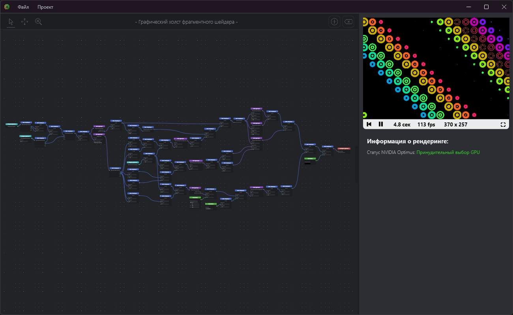
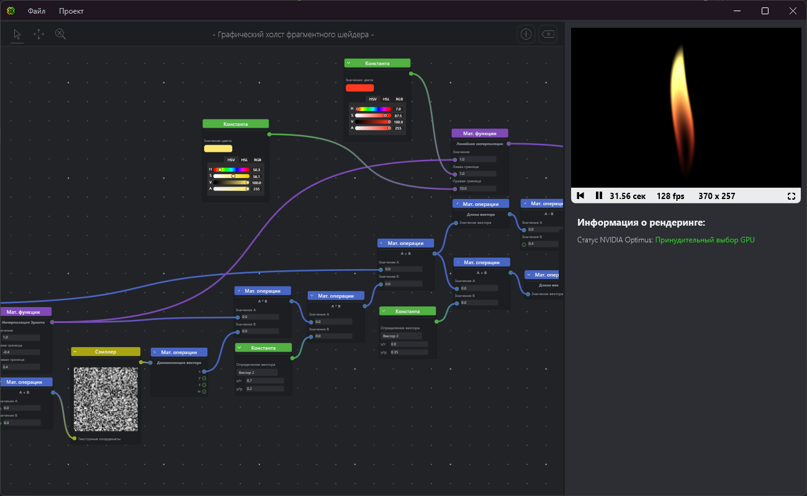

# ShaderGraphToy
#### Your way to easily create fragment shaders and use them everywhere
>[!warning]
>This app is in early access and may be unstable and have many bugs. At the moment it only supports Russian localization, English is in development.

*- Jewels example project*

*- Flame example project*

#### Key Features
- Visual editor based on node system
- Real-time shader rendering on GPU
- Shader export to GLSL
- Over 50 available nodes

#### Features in development
- English localization
- Data channels system (multiple textures, keyboard maps, cubemaps)
- New renderer (native C++ OpenGL engine instead of OpenTk)
- Shader export to image and video formats
- Shader export for Godot Engine (CanvasItem and Spacial)
- GLSL code optimization
- Nodes for matix operations
- Many new nodes (noise, filters, custom expressions, conditions, loops, ...)
___

## How to use

#### Controls
- To translate the canvas ***hold mouse wheel*** or use the canvas toolbar
- To zoom the canvas ***scroll mouse wheel*** or use the canvas toolbar
- To draw a selection area ***hold left mouse button***
- Graph nodes can be dragged by the ***header***
- If multiple nodes are selected, they can be dragged ***anywhere***
- To select multiple nodes, hold the ***Shift*** key
- To create a new node, press ***Ctrl+N*** or use the canvas toolbar
- To delete node(s), press ***Delete*** key or use the canvas toolbar
- To compile the graph, press ***F5*** (autocompilation is currently disabled)
- To load a texture into a texture node, simply click on the texture image

#### Example Projects
The example projects are located in the ***ExampleProjects*** folder in this repository. You can load them by clicking ***Файл -> Открыть проект***. Note that the application does not save the textures used in the project files (for now), so you need to load them manually.

#### Export Code
To export the shader code, go to ***Проект -> Экспорт кода***. Note that only GLSL export is available at the moment.
___

## Contribution
#### Project overview
Solution contains four projects:
- ShaderGraphToy - GUI based on WPF and renderer based on OpenTk
- Nodes2Shader - C# library that contains all nodes data (descriptions, contents and expressions) and converts visual graph into GLSL code
- ToyRenderer - native C++ OpenGL renderer, for now in progress
- ToyRendererDLL - ToyRenderer wrapper for importing in C# WPF

#### Dependencies
- OpenTk 4.8.2 (ShaderGraphToy)
- Newtonsoft.Json 13.0.3 (ShaderGraphToy, Nodes2Shader)
- OpenTk.GLWpfControl 4.3.2 (ShaderGraphToy)
- PixiEditor.ColorPicker 3.4.2 (ShaderGraphToy)
- StbImageSharp 2.30.15 (Nodes2Shader)
- Glad 0.1.36 - glad.c, glad_wgl.c (ToyRenderer)

#### Special thanks
- RedSphere shader (modified) by ***jimmikaelkael*** https://www.shadertoy.com/view/XlXGDj
- Jewels shader by ***conceptionist*** https://www.shadertoy.com/view/WXsXDH
- Balatro shader (modified) by ***xxidbr9*** https://www.shadertoy.com/view/XXtBRr
- Flame shader (modified) by ***supah*** https://www.shadertoy.com/view/3XfXRN
- LavaLamp shader by ***edankwan*** https://www.shadertoy.com/view/3sySRK
- Icons by ***Icons8*** https://icons8.com/icons
